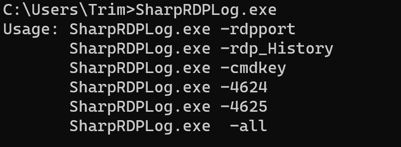
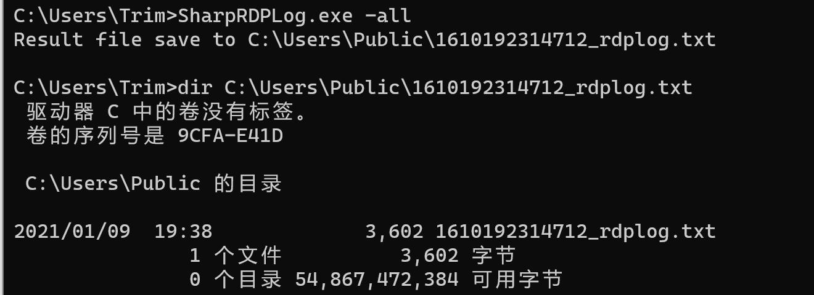
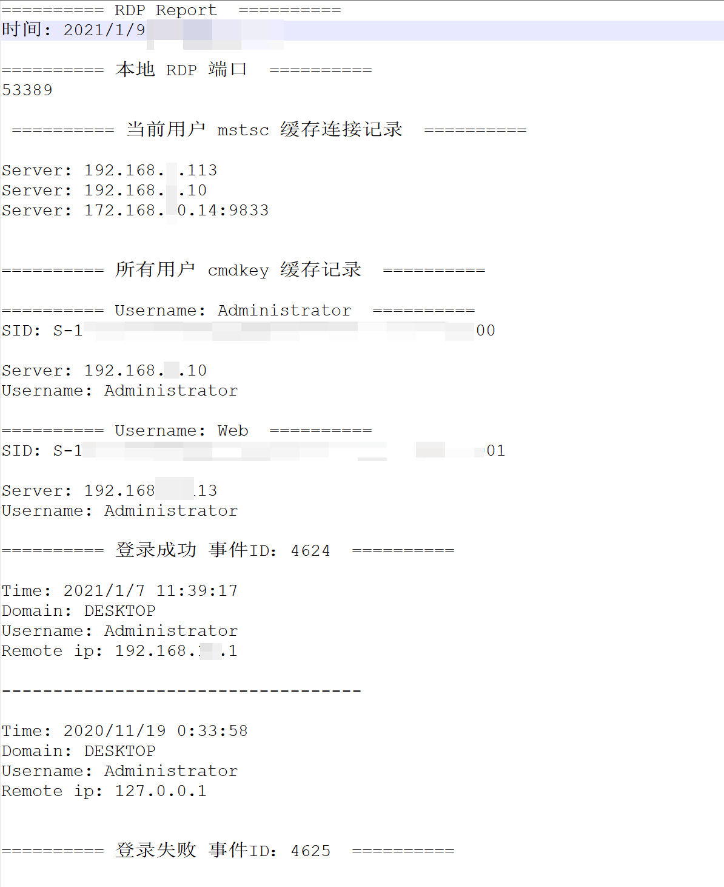

# SharpRDPLog

      

### 简介

- **Windows rdp相关的登录记录导出工具，用于后渗透中Windows服务器的RDP相关的信息收集。输出内容包括：本地rdp端口、mstsc缓存、cmdkey缓存、登录成功、失败日志事件。**

- **运行前需要bypassUAC后的管理员权限权限**

### 说明
**由于代码比较简单，已经编译了.Net 3.5版本的可执行文件，需要的可以直接到[releases](https://github.com/Adminisme/SharpRDPLog/releases)下载，下面主要分享和提供思路供大家参考。**

#### 1、查看本地rdp TCP端口

原理：通过读取系统注册表信息获取rdp TCP端口。

注册表Path：

```
计算机\HKEY_LOCAL_MACHINE\SYSTEM\CurrentControlSet\Control\Terminal Server\WinStations\RDP-Tcp
```


#### 2、导出当前用户mstsc远程登录服务器记录
输出：ip地址：端口

原理：通过读取系统注册表信息获取mstsc缓存记录。

注册表Path：

```
计算机\HKEY_CURRENT_USER\SOFTWARE\Microsoft\Terminal Server Client\Default
```


#### 3、导出本地所有用户rdp登录服务器记录

输出包括：ip地址、登录用户名

原理：通过调用WMI API接口获取所有当前系统所有用户的Name、SID，通过系统注册表依次读取获取该用户登录记录，类似cmdkey /list功能，区别于可以导出系统内所有用户记录登录信息。

注册表Path：

```
系统当前用户：
计算机\HKEY_CURRENT_USER\SOFTWARE\Microsoft\Terminal Server Client\Servers

系统全局用户：
计算机\HKEY_USERS\{SID}\SOFTWARE\Microsoft\Terminal Server Client\Servers\
```


#### 4、导出服务器被登录事件，获取当前服务器被登录记录

参考：https://github.com/uknowsec/SharpEventLog 

输出包括：时间、源IP地址、域名、用户名

原理：通过Win API 获取windows事件安全日志中ID为4624、4625的事件，提取事件中的关键信息。


### Usage:

```
C:\Users\Trim>SharpRDPLog.exe
Usage: SharpRDPLog.exe -rdpport        #本地RDP端口
       SharpRDPLog.exe -rdp_History    #当前用户的mstsc缓存和当前用户的cmdkey缓存
       SharpRDPLog.exe -cmdkey         #所有用户的cmdkey缓存
       SharpRDPLog.exe -4624           #登录成功事件
       SharpRDPLog.exe -4625           #登录失败事件
       SharpRDPLog.exe  -all           #全部输出
```




### 运行样例：




### 输出样例：




